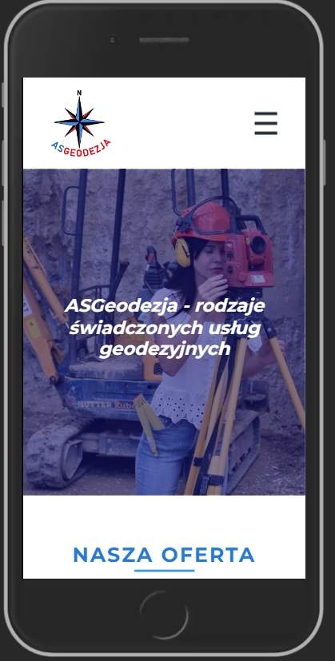

<h1>Geodesy Website</h1>

Landing page for ASGeodezja is built with Next.js, delivering a modern, responsive design. It’s SEO-optimized and uses Next.js API routes for dynamic content delivery.

Check out the live demo hosted on Vercel:   
<a href="https://asgeodezja.vercel.app">ASGeodezja</a>

<strong>Note:</strong> The website is available in my native language - Polish.

<h2>📋 Features</h2>

<ul>
  <li>Fully functional business card website for a surveying company</li>
  <li>A main page and three additional subpages:
    <ul>
      <li>Services</li>
      <li>About Us</li>
      <li>Contact</li>
    </ul>
  </li>
  <li>Accessibility-friendly practices</li>
  <li>SEO-optimized structure</li>
  <li>Custom "Not Found" page</li>
  <li>Fully responsive design</li>
  <li>Adherence to core design principles</li>
</ul>

<h2>🛠 Tools and Technologies</h2>

<ul>
  <li>React</li>
  <li>Next.js</li>
  <li>TypeScript</li>
  <li>JavaScript</li>
  <li>Git / GitHub</li>
</ul>

